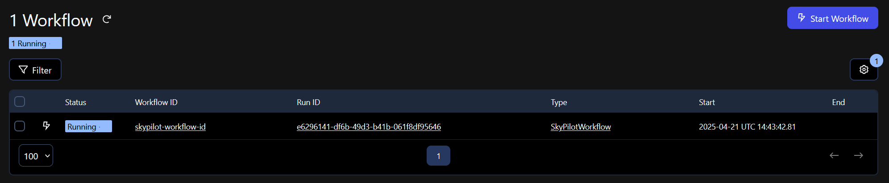
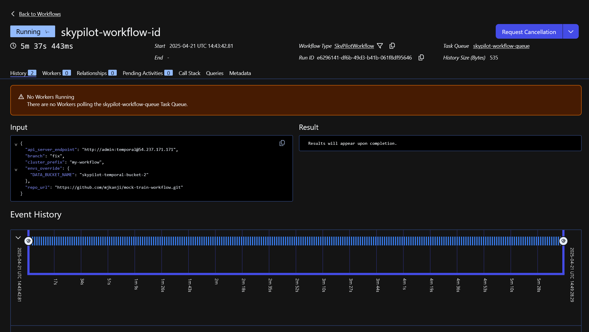
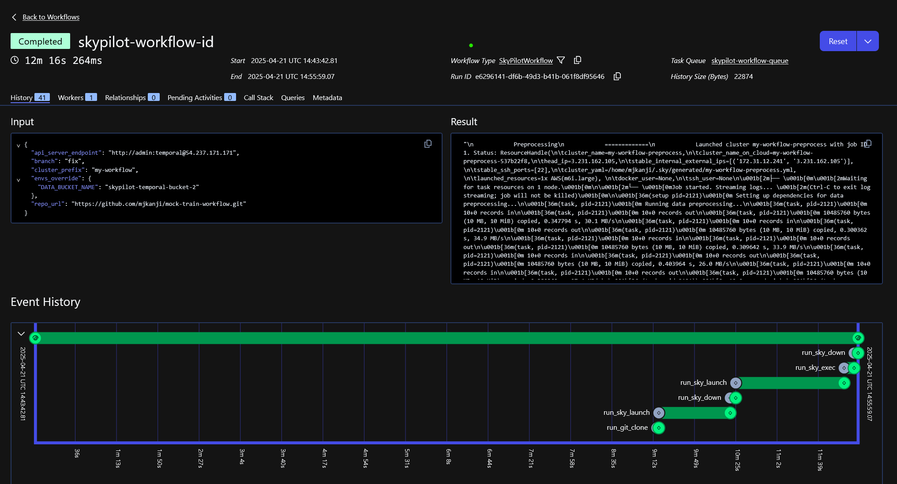

# TODOs

- Finalize how env vars are set (`export` or `source .env`).
- Should the example live in a separate repo?

# Durable Execution of AI Workloads with Temporal and SkyPilot

AI is eating the world — and your org's budget. With the growing demand for AI-powered features across industries, GPU scarcity, higher costs, and managing complex infrastructure are all hampering data and AI teams' ability to innovate and deliver new products effectively.

Temporal [helps AI/ML developers model and durably execute their workflows](https://temporal.io/blog/ai-ml-and-data-engineering-workflows-with-temporal), but managing the infrastructure to power these workflows remains a challenge. 

Improving GPU availability and reducing costs by incorporating multiple providers is one obvious solution, but the operational overhead from managing a multi-cloud setup can be rather significant, often requiring a dedicated DevOps team and more than one Kubernetes ninja.

Surely, there's a better way to do this?

## Enter SkyPilot: Run AI on Any Infra

SkyPilot abstracts the complexities of multi-cloud setups by presenting all of your cloud infrastructure as a unified compute pool — the Sky to your clouds. 

It offers a simple, unified, and declarative interface for defining and provisioning infrastructure across this unified compute pool. This enables AI teams to quickly and easily launch AI training, inference, and batch workloads across cloud providers without needing deep expertise in infrastructure or DevOps.

Say you want to run an AI training job on a GPU-accelerated machine with 4 vCPUs, 16GB of RAM, and an A100. With SkyPilot, it's as simple as defining your requirements in a YAML file:

```yaml 
resources:
  cloud: aws
  region: us-east-1
  cpu: 4
  memory: 16
  accelerators: A100

setup: |
  pip install my-dependencies

run: |
  python run my-training-job.py
```

Then, run the following from your terminal:

```bash
sky launch -c mycluster training_job.yaml
```

SkyPilot provisions the VM, runs the job, then shuts down the machine.

If the GPU configuration isn't available in the selected region, simply remove the `region:` line and SkyPilot will search across all regions.

Better yet, instead of specifying a select cloud provider, you can let SkyPilot choose one for you. It'll automatically look through the catalog of the 16+ providers it currently supports and choose the cheapest available option.


SkyPilot also supports managed job queues with spot instances (with automatic recovery from preemption), hyperparameter search across thousands of instances on multiple clouds, and reproducible cloud development environments. When it's time to deploy, it can serve your LLM and scale automatically across clouds and regions.

## Temporal + SkyPilot: Durable Execution across Clouds

AI pipelines typically consist of many interdependent steps that can fail and require retries. Temporal is ideal for orchestrating such workflows, and using SkyPilot and Temporal together can supercharge your AI team's productivity by abstracting both infrastructure management and process orchestration, allowing AI developers to focus on optimizing business logic and model performance.

Below, we show an example of using Temporal to orchestrate SkyPilot tasks. 

### Setup

Start by setting up a SkyPilot API server, which handles infrastructure provisioning and state. Follow the [API server deployment guide](https://docs.skypilot.co/en/latest/reference/api-server/api-server-admin-deploy.html).

Then, install SkyPilot on your Temporal workers and log in to the API server:

```bash
$ pip install -U skypilot-nightly
$ sky api login
```

For this example, we'll work with a mock workflow consisting of data preprocessing, training, and evaluation steps [defined as SkyPilot tasks](https://github.com/skypilot-org/mock-train-workflow/tree/clientserver_example). These tasks are wrapped in Temporal Activities and composed into an end-to-end ML workflow. 

You can find the full code for the demo here.

### Explanation

The `SkyPilotWorkflow` is broken down into six different activities. Let's go through them one by one:

```python
@workflow.defn
class SkyPilotWorkflow:

    @workflow.run
    async def run(self, input: SkyPilotWorkflowInput) -> str:
        ...
        # 1. Clone the repository and retrieve YAML contents
        ...
        clone_result = await workflow.execute_activity(
            run_git_clone,
            GitCloneInput(repo_url=repo_url,
                          clone_path=clone_path,
                          yaml_file_paths=yaml_paths,
                          branch=branch,
                          api_server_endpoint=api_server_endpoint),
            start_to_close_timeout=timedelta(minutes=5),
            retry_policy=retry_policy,
            task_queue=WORKER_TASK_QUEUE,
        )
```

This activity clones the `mock-train-workflow` repo from GitHub onto the worker, so it has access to the code that the SkyPilot job must execute.

The next step in our AI pipeline is preprocessing some data to prepare it for model training. Let's look at the definition of this task:

```yaml
# data_preprocessing.yaml
resources:
  cpus: 1+
  cloud: aws

envs:
  DATA_BUCKET_NAME:
  DATA_BUCKET_STORE_TYPE: s3

file_mounts:
  /data:
    name: $DATA_BUCKET_NAME
    store: $DATA_BUCKET_STORE_TYPE

setup: |
  echo "Setting up dependencies for data preprocessing..."

run: |
  echo "Running data preprocessing..."
  
  # Generate few files with random data to simulate data preprocessing
  for i in {0..9}; do
      dd if=/dev/urandom of=/data/file_$i bs=1M count=10
  done
  
  echo "Data preprocessing completed, wrote to $DATA_BUCKET_NAME"
```

This mock task simply writes random data to S3. In a production setting, this may involve normalizing your dataset, feature engineering, splitting the data into training and test sets, etc. 

Next, we launch this task using the `run_sky_launch` activity. This takes the YAML config above as input and uses SkyPilot to launch a VM to execute this task.

```python
@workflow.defn
class SkyPilotWorkflow:

    @workflow.run
    async def run(self, input: SkyPilotWorkflowInput) -> str:
        ...
        
        # 2. Launch data preprocessing
        preprocess_yaml = clone_result.yaml_contents["data_preprocessing.yaml"]
        cluster_name = f"{cluster_prefix}-preprocess"

        preprocess_result = await workflow.execute_activity(
            run_sky_launch,
            SkyLaunchCommand(cluster_name=cluster_name,
                             yaml_content=preprocess_yaml,
                             launch_kwargs=launch_kwargs,
                             envs_override=input.envs_override,
                             api_server_endpoint=api_server_endpoint),
            start_to_close_timeout=timedelta(minutes=30),
            retry_policy=retry_policy,
            task_queue=WORKER_TASK_QUEUE,
        )
```

Let's examine the `run_sky_launch` activity in more detail:

```python
@dataclass
class SkyLaunchCommand:
    """Command to launch a SkyPilot cluster with a task."""
    cluster_name: str
    yaml_content: str
    launch_kwargs: Dict[str, Any] = None
    envs_override: Dict[str, str] = None
    api_server_endpoint: Optional[str] = None
    
@activity.defn
async def run_sky_launch(input: SkyLaunchCommand) -> str:
    ...
    import sky

    # Parse the YAML content into a task config
    task_config = yaml.safe_load(input.yaml_content)
    ...
    # Create task from config
    task = sky.Task.from_yaml_config(task_config)
    ...
    # Launch the task, passing kwargs directly to sky.launch
    launch_request_id = sky.launch(task,
                                   cluster_name=input.cluster_name,
                                   **launch_kwargs)
    # Run the blocking stream_and_get in a separate thread
    job_id, status = await asyncio.to_thread(sky.stream_and_get,
                                             launch_request_id)
    ...
    return f"Launched cluster {input.cluster_name} with job ID {job_id}. Status: {status}\n{log_output}"
```

It's mostly just set up for the configuration SkyPilot needs to execute the job. The main item of note is the call to the `sky.launch` command to launch the job based on the YAML task definition. 

Additionally, because the remote task may execute for a while, we use `asyncio.to_thread` to run the `sky.stream_and_get` call in a separate thread to avoid blocking the Temporal event loop.

Once SkyPilot has launched and executed the task, it will keep the provisioned remote cluster running (unless you launch the cluster with auto-stop enabled). 

To make sure we clean up any resources and shut down the cluster, the next step in the workflow calls the `run_sky_down` activity on the cluster:

```python
@workflow.defn
class SkyPilotWorkflow:

    @workflow.run
    async def run(self, input: SkyPilotWorkflowInput) -> str:
        ...
        
        # 3. Down the cluster
        down_result = await workflow.execute_activity(
            run_sky_down,
            SkyDownCommand(cluster_name=cluster_name,
                           api_server_endpoint=api_server_endpoint),
            start_to_close_timeout=timedelta(minutes=10),
            retry_policy=retry_policy,
            task_queue=WORKER_TASK_QUEUE,
        )
```

This activity uses the SkyPilot Python API to instruct the API server to tear down the cluster:

```python
@dataclass
class SkyDownCommand:
    """Command to terminate a SkyPilot cluster."""
    cluster_name: str
    api_server_endpoint: Optional[str] = None
    
@activity.defn
async def run_sky_down(input: SkyDownCommand) -> str:
    ...
    import sky

    down_request_id = sky.down(cluster_name=input.cluster_name)
    await asyncio.to_thread(sky.stream_and_get, down_request_id)
	...
```

We have now successfully preprocessed our data, and it's ready for training. We can reuse the same `run_sky_launch` activity to launch the training job by replacing the `yaml_content` argument with the config for the training job.

```python
@workflow.defn
class SkyPilotWorkflow:

    @workflow.run
    async def run(self, input: SkyPilotWorkflowInput) -> str:
        ...
        
        # 4. Launch training
        train_yaml = clone_result.yaml_contents["train.yaml"]
        train_result = await workflow.execute_activity(
            run_sky_launch,
            SkyLaunchCommand(...
                             yaml_content=train_yaml, # This is the only change
                             ...),
            ...
        )
```

Next, we evaluate the trained model. Since training and inference often have similar computational requirements, we re-use the cluster that we provisioned for training through the `run_sky_exec` activity:

```python
@workflow.defn
class SkyPilotWorkflow:

    @workflow.run
    async def run(self, input: SkyPilotWorkflowInput) -> str:
        ...
        
        # 5. Execute evaluation on the same cluster
        eval_yaml = clone_result.yaml_contents["eval.yaml"]

        eval_result = await workflow.execute_activity(
            run_sky_exec,
            SkyExecCommand(cluster_name=cluster_name, # Re-use the training cluster
                           yaml_content=eval_yaml,    # Use the evaluation task definition 
                           ...),
            ...
        )
```

The `run_sky_exec` activity is very similar to the `run_sky_launch` activity from earlier, with the only difference being that it executes a command on an already-running cluster, while `run_sky_launch` provisions the cluster first.

```python
@dataclass
class SkyExecCommand:
    """Command to execute a task on an existing SkyPilot cluster."""
    cluster_name: str
    yaml_content: str
    exec_kwargs: Dict[str, Any] = None
    envs_override: Dict[str, str] = None
    api_server_endpoint: Optional[str] = None

@activity.defn
async def run_sky_exec(input: SkyExecCommand) -> str:
    ...
    import sky

    # Parse the YAML content into a task config
    task_config = yaml.safe_load(input.yaml_content)
    ...
    
    # Create task from config
    task = sky.Task.from_yaml_config(task_config)
    ...

    # Execute the task on the existing cluster, passing kwargs directly to sky.exec
    exec_request_id = sky.exec(task,
                               cluster_name=input.cluster_name,
                               **exec_kwargs)

    # Run the blocking stream_and_get in a separate thread
    job_id, handle = await asyncio.to_thread(sky.stream_and_get,
                                             exec_request_id)
    ...
    return f"Executed task on cluster {input.cluster_name} with job ID {job_id}.\n{log_output}"
```

Finally, before completing the workflow, we shut down the training cluster:

```python
@workflow.defn
class SkyPilotWorkflow:

    @workflow.run
    async def run(self, input: SkyPilotWorkflowInput) -> str:
        ...
        
        # 6. Down the cluster
        down_result = await workflow.execute_activity(
            run_sky_down,
            SkyDownCommand(cluster_name=cluster_name,
                           api_server_endpoint=api_server_endpoint),
            start_to_close_timeout=timedelta(minutes=10),
            retry_policy=retry_policy,
            task_queue=WORKER_TASK_QUEUE,
        )
```

### Demo

Next, let's try running the example using Temporal. To do so, you'll need to have Temporal SDK for Python and the Temporal CLI installed on your machine. Instructions on how to do so can be found [here](https://learn.temporal.io/getting_started/python/dev_environment/).

With your development environment set up, start a local instance of the Temporal service:

```bash
temporal server start-dev
```

This will start the Temporal Service (usually at port 7233) and Temporal Web UI (usually at port 8233).

Next, open a new terminal to schedule the workflow for execution:

```bash
# In a new terminal, set the env vars and run the workflow
source .env
python run_workflow.py
```

If you go to the Temporal Web UI (normally at `http://localhost:8233`), you can see the Workflow listed.



Click on `skypilot-workflow-id` to see more details about the execution of the workflow.



In this case, we see that the Workflow is queued but has not yet started execution because there are no available Workers. To fix this, start a local Worker to execute the workflow from a new terminal:

```bash
# In a new terminal, set the env vars and start the worker
source .env
python run_worker.py
```

When you go back to the Temporal Web UI, you should see the event history and logs from the workflow streaming in. When the workflow has successfully executed, you should see the different activities, their status, and retry attempts (if any) laid out in the Event History:



## Wrapping Up

In this example, we demonstrated how Temporal and SkyPilot can help your AI team move faster by simplifying infrastructure management and process orchestration, allowing them to focus on optimizing business logic and model performance.

If you're a platform engineer, this might be particularly interesting to you because using SkyPilot with Temporal allows you to quickly onboard data scientists' experiments into production settings. 

During R&D, your data team can rapidly iterate and provision resources using SkyPilot's declarative API independently, without needing to learn about how Temporal works. And when it's time to deploy the trained models to production, they can bring over their SkyPilot task specifications to Temporal by reusing a generic set of Temporal Activities (like the ones we used in this example) to run any SkyPilot task, minimizing any overhead for the platform engineering team during deployment.
